= Advanced Coding Assistant
:toc: left

// Core Tech & Platform
image:https://img.shields.io/badge/Java-21-ED8B00?style=flat&logo=openjdk&logoColor=white[Java]
image:https://img.shields.io/badge/Spring%20Boot-Latest-6DB33F?style=flat&logo=spring-boot&logoColor=white[Spring Boot]
image:https://img.shields.io/badge/Maven-3-C71A36?style=flat&logo=apache-maven&logoColor=white[Maven]

// AI/ML Components
image:https://img.shields.io/badge/LangChain4J-0.34.0-2496ED?style=flat[LangChain4J]
image:https://img.shields.io/badge/OpenAI-Ready-412991?style=flat&logo=openai&logoColor=white[OpenAI]
image:https://img.shields.io/badge/Azure%20OpenAI-Ready-0078D4?style=flat&logo=microsoft-azure&logoColor=white[Azure OpenAI]
image:https://img.shields.io/badge/AWS%20Bedrock-Ready-0077D5?style=flat&logo=microsoft-azure&logoColor=white[Azure OpenAI]
image:https://img.shields.io/badge/Google%20Vertex%20AI-Ready-4285F4?style=flat&logo=google-cloud&logoColor=white[Vertex AI]
image:https://img.shields.io/badge/OpenAI%20API-Ready-412881?style=flat&logo=openai&logoColor=white[OpenAI API]

// Database
image:https://img.shields.io/badge/Neo4j-Ready-008CC1?style=flat&logo=neo4j&logoColor=white[Neo4j]

// Code Analysis
image:https://img.shields.io/badge/TreeSitter-22_Languages-green?style=flat[Tree-Sitter]

// Testing
image:https://img.shields.io/badge/JUnit5-Ready-25A162?style=flat&logo=junit5&logoColor=white[JUnit5]
image:https://img.shields.io/badge/Testcontainers-Ready-2496ED?style=flat&logo=docker&logoColor=white[Testcontainers]

// Infrastructure
image:https://img.shields.io/badge/Docker-Ready-2496ED?style=flat&logo=docker&logoColor=white[Docker]
image:https://img.shields.io/badge/GitLab_API-Ready-FC6D26?style=flat&logo=gitlab&logoColor=white[GitLab]

== Overview
Advanced Coding Assistant is an experimental research and development (R&D) project designed as an innovative orchestration platform that enables semantic code understanding through interactive documentation. While fully functional, this project is primarily intended for research and experimentation purposes, and no artifacts will be distributed commercially. Its core purpose is to allow developers to have intelligent conversations with their code repositories, providing comprehensive code understanding through a combination of Knowledge Graph technology and Large Language Models (LLMs).

This R&D initiative serves as a proof of concept and experimental platform for exploring advanced code comprehension techniques. While the system is fully usable and implements production-grade features, its primary goal is to facilitate research and experimentation in the field of AI-assisted software development.

=== Key Features
•	Understanding the whole codebase (GraphRAG)
•	Secure (you can run the whole product including an LLM locally)
•   Choose your own LLM provider (AWS Bedrock, Google Vertex, Azure OpenAI...)
•   Accurate - when utilizing Agentic RAG
•	Fast - when utilizing State Machine Data Retrieval
•	Cheap - when utilizing State Machine Data Retrieval
•	OpenAI API standards (you can plug and play anything that follows OpenAI standards)

Advanced Coding Assistant is able to provide comprehensive code understanding due to the way it stores data:

* **Implicit semantic data enrichment**: embeddings - intuitive understanding
* **Explicit semantic data enrichment**: knowledge graphs - provides explainability and accountability.

video::4SqG5EA10lo[youtube]

=== Supported Programming Languages

[source]
----
* Bash
* C
* Common Lisp
* C#
* Go
* HTML
* Java
* JavaScript
* Perl
* PHP
* Python
* R
* Rust
* SQL 
* Swift
* TypeScript
* Visual Basic
* VBScript
----

=== Design
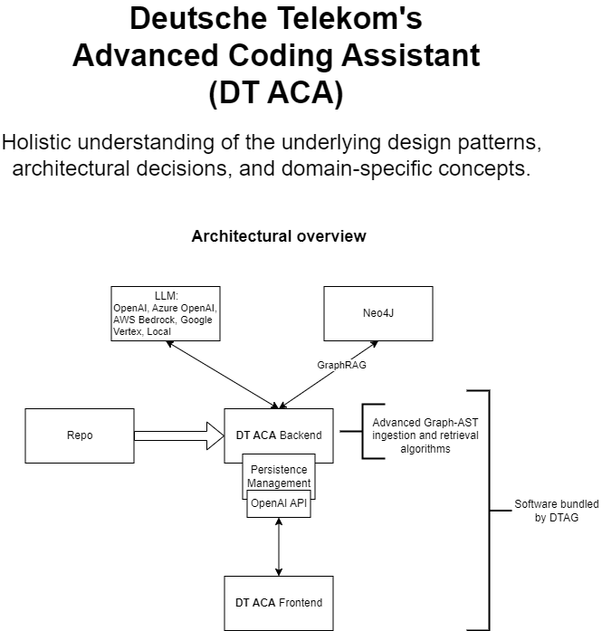

==== Technologies and frameworks used

- Java
- https://spring.io/projects/spring-boot[SpringBoot]
- https://docs.langchain4j.dev/[LangChain4J]
- https://neo4j.com/[Neo4J]

=== Vision
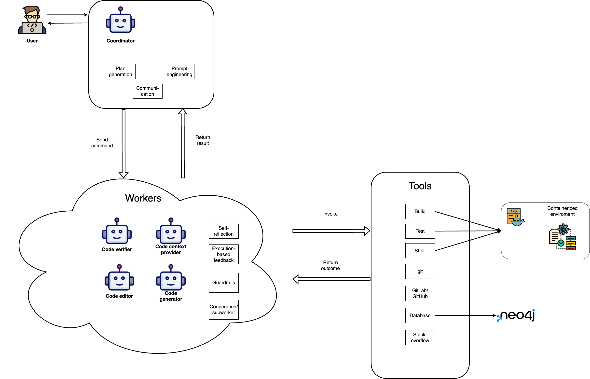

This is the vision of Advanced Coding Assistant, to be a multi-agent solution for
solving many software engineering tasks.

The graph shows that we have an agent that handle the request from the user, and coordinate
the work to the worker agents. Worker agents have different responsibility and access to
different tools that allows it to perform the task. For example, the "Code verifier" agent
should have access to Build and Test tools in order to build and test the generated source
code. Research has shown that multi-agent approach can solve more than 8-12x more problem
than RAG approcahes, reaching the state-of-the-art performances on many tasks, including
enable LLM on solving tasks that RAG approaches is not even capable of.

== Installation

**Note**: The application has been thoroughly tested only with the `azure` profile up until now. It is possible
that other connections/profiles (`vertex`, `bedrock`, `openai`, `local`) will not work as expected.

The application is made up of:

* Neo4J database (started by `docker-compose.yaml`)
* ELK stack (started by `docker-compose.yaml`)
* Backend - Java SpringBoot application
* Frontend - React Application - https://github.com/telekom/advanced-coding-assistant-frontend

Ideally, you should have `Docker Desktop` installed and `Java 21`.

**Note**: If you want to upload the repository through GitLab, before starting the application you should set the `aca.gitlab.token` property in the `application.properties` file to your GitLab token. This token must have sufficient permissions to clone the repository(read_api).
Then you can pass the project ID either from the frontend or directly to the backend via the API.

Default profile when the backend starts is `azure`, meaning the application will try to connect to azure infrastructure
to communicate with a Large Language Model.

When starting the JAR file, you can choose different profiles by e.g.: `--spring.profiles.active=bedrock`

All possible configuration properties can be found in these files:

----
advanced-coding-assistant-backend/chatbot-openai-code-migration-app/src/main/resources/application.properties
advanced-coding-assistant-backend/chatbot-openai-code-migration-app/src/main/resources/application-azure.example.properties
advanced-coding-assistant-backend/chatbot-openai-code-migration-app/src/main/resources/application-bedrock.example.properties
advanced-coding-assistant-backend/chatbot-openai-code-migration-app/src/main/resources/application-local.example.properties
advanced-coding-assistant-backend/chatbot-openai-code-migration-app/src/main/resources/application-openai.example.properties
advanced-coding-assistant-backend/chatbot-openai-code-migration-app/src/main/resources/application-vertex.example.properties
----

For more information on how to choose an LLM please have a look at <<choose_llm, this>> section.

==== Development Environment (installation via IDE)

1. Before you pull the project, make sure that you have git lfs installed: https://git-lfs.com/.
Because it is used to upload the large embedding model
2. Then, you will have to install the following Software: Docker,  Git, JDK and a java IDE of your choice.
3. Setting up the Neo4J (Graph Database) and the ELK Stack.
Open up a terminal and locate your backend project folder and execute the following commands there:
`docker-compose up` This will start Neo4J and ELK stack for you.
4. For the Backend you need to clone the backend repository to your local machine. After that you have to configure
your azure profile `advanced-coding-assistant-backend/chatbot-openai-code-migration-app/src/main/resources/application-azure.example.properties` (<<choose_llm,or you can choose>> a local LLM deployment or AWS Bedrock or Google Vertex...)
by inserting the required data (azure.endpoint, azure.model, azure.api-key). After inserting these you will have to
remove the `.example` extension from the properties file.
5. For the Frontend please take a look at our Frontend Repository and its readme found https://github.com/telekom/advanced-coding-assistant-frontend[here]
6. Now you can start the Backend through the `ChatbotCodeMigrationApplication.java` and the React Frontend as explained in the FE readme https://github.com/telekom/advanced-coding-assistant-frontend[here].

[[choose_llm]]
=== Choosing an LLM Provider

The Advanced Coding Assistant supports multiple LLM providers. Each provider corresponds to a profile that can be configured and used to run the application.

The supported LLM providers and their corresponding profiles are:

- OpenAI (`openai`)
- Microsoft Azure OpenAI (`azure`)
- Amazon Bedrock (`bedrock`)
- Google Vertex AI (`vertex`)
- Local (`local`)

==== Configuring a Profile

To use a specific LLM provider, you need to configure the corresponding profile. Follow these steps:

1. Locate the `application-{profile}.example.properties` file in the `resources` folder of the `chatbot-openai-code-migration-app` module, while `{profile}` stands for the desired profile.
2. Copy the content of the example file to a new file named `application-{profile}.properties`.
3. Fill in the values of the properties in the new file.

==== Running the Application with a Profile

Once you've configured a profile, you can run the application using one of the following methods:

===== IntelliJ IDEA

Using IntelliJ Idea IDE the application contains several run configurations (found in `.run` directory).

If you're using IntelliJ IDEA, you can use the run configuration to run the profile. Select your desired profile from the dropdown menu in the top right corner of the IDE.

===== Command Line

If you prefer the command line, use the following command. Replace `yourProfileName` with the name of your desired profile:

----
mvn spring-boot:run -Dspring-boot.run.profiles=yourProfileName
----

===== Application Properties File

Alternatively, you can set the active profile in the `application.properties` file. Set the `spring.profiles.active` property to your desired profile. Then, run the application as usual.

=== Proxy setup

This application directly supports proxy settings only for **azure profile**. If you are behind a proxy and you want to use other profiles than `azure`, 
you have to handle proxy on system level.

In `application-azure.properties` configure `azure.proxy=` property, for example

----
azure.proxy=127.0.0.1:9563
----

When running the application as a JAR file, add to your command a suffix, e.g.: `--azure.proxy=127.0.0.1:9563`

== General workflow with Advanced Coding Assistant Frontend

For direct API usage, please see section <<direct-api, Direct API usage>>

When using our https://github.com/telekom/advanced-coding-assistant-frontend[Frontend]
start by uploading a repo:

. In the lower left corner click on `Settings`
. Choose `Repository`
. Paste an absolute path (Gitlab ingestion also supported) of the repository you want to ingest, e.g. `C:\Users\you\IdeaProjects\your-repo`

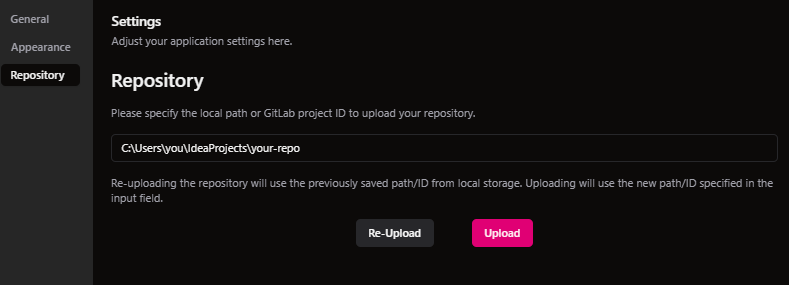

. Click the `Upload` button. This will add the repository to any other repository you already ingested
. Alternatively, you can click the `Re-Upload` button. This will **delete all previously ingested** repositories and start
to ingest the selected repository.
. Depending on the repository size, the ingestion will take some time. Please wait until in the upper right corner you
can see a message saying: _Done. Repository uploaded successfully._
. You can now chat with your repository. Advanced Coding Assistant will use all repositories that were ingested.

== Showcase with pvlib/pvlib-python for automatic bug fix recommendation

https://github.com/pvlib/pvlib-python[pvlib/pvlib-python] is an open source GitHub repository for simulating the performance of photovoltaic energy systems.
One https://github.com/pvlib/pvlib-python/issues/1831[issue] was reported to repository at commit 27a3a07ebc84b11014d3753e4923902adf9a38c0.
This https://github.com/pvlib/pvlib-python/pull/1854[pull request] was later merged to fix this issue.

In this example, we will use Advanced Coding Assistant to ingest the pvlib/pvlib-python repository. Ask our
chatbot to suggest fixes to this issue, and check if the answer is the same as the human written pull request.

We simply add some context in the prompt, before we copy paste the issue description as it is. Here is the full prompt:

image::readme-resources/pvlib-1.png[pvlib prompt, width=600]

Here the answer by Advanced Coding Assistant

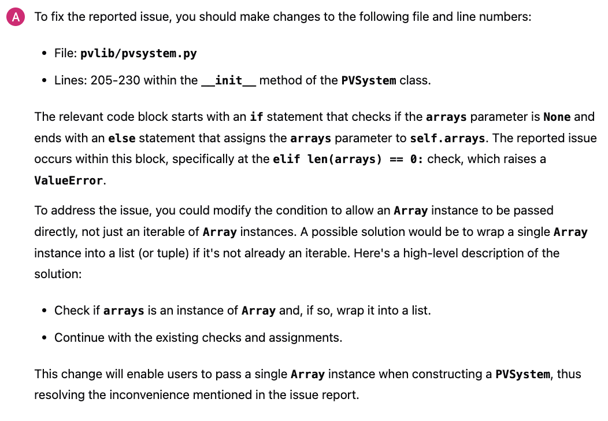

When looking at the pull request, we can see that the file, line number and the suggest change are correct.
We can verify it by asking for the actual implementation.

image::readme-resources/pvlib-3.png[pvlib details, width=600]

This change suggested by Advanced Coding Assistant is exactly what is changed in the pull request.
[source,python]
----
elif isinstance(arrays, Array):
    # Wrap a single Array instance into a tuple
    self.arrays = (arrays,)
----

[[direct-api]]
== Direct API usage

Standard server port is `8152`

Advanced Coding Assistant backend is a standalone application, meaning it can function as a plugin or be deployed on
a server. We publish standard OpenAI APIs and other supporting endpoints:

To test out these endpoints, you can use <<bruno-client, Bruno Client>>

[[bruno-client]]
=== Bruno client
Bruno client is similar to Postman. It is a tool for testing REST APIs. It is a desktop application that allows you to
send HTTP requests to a server and review the responses.

The main advantage is that Bruno allows to store collections of requests and share them with other team members within
one repository.

Bruno client is available for download at https://www.usebruno.com/

You can find the collection of requests for this project in `openai-api/bruno_collection/OpenAI API`. You can import
this collection into your Bruno client and start testing the OpenAI API. Also, environment variables are shared within
the repository.

Open a Bruno Collection:

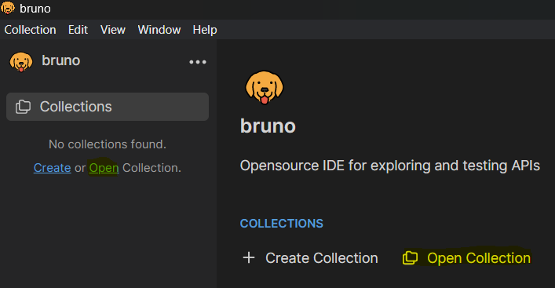

Select an environment:

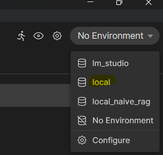

Run a request:

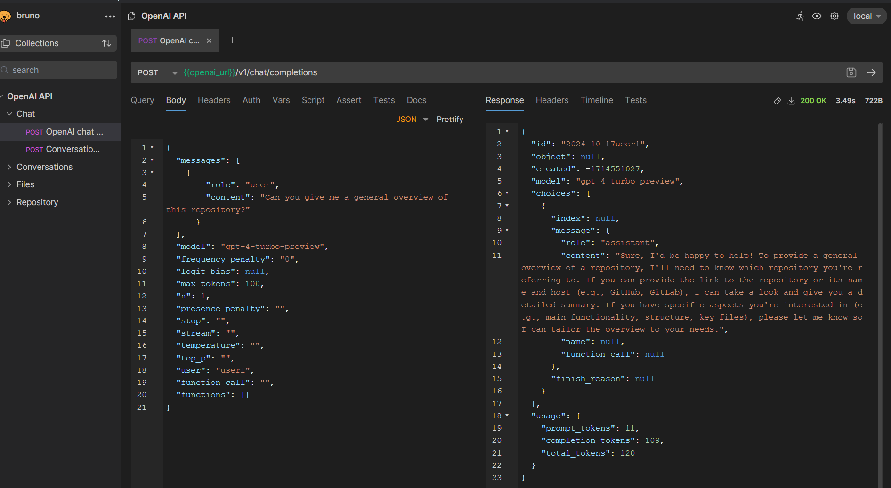

== Conversation with Memory

The application now supports storing and retrieving conversations, allowing for persistent chat history. This feature is implemented using Neo4j as the storage backend and is designed to be compliant with OpenAI API standards.

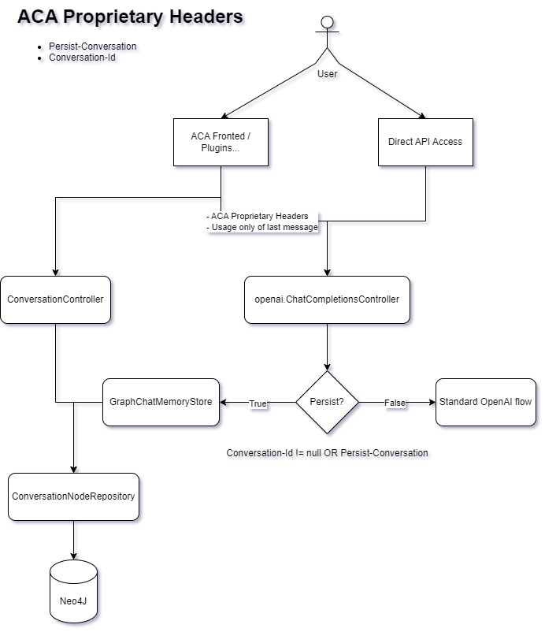

Representation of a conversation in Neo4J DB:

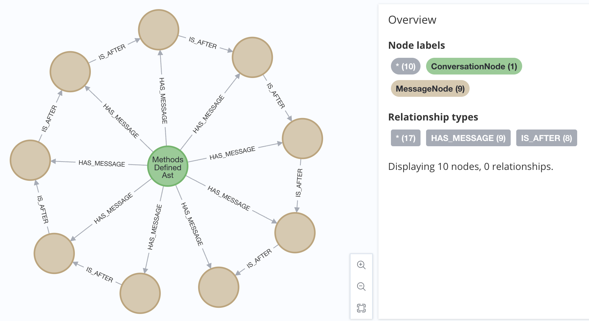

Messages follow this pattern `MessageNode <-IS_AFTER- MessageNode <-IS_AFTER- MessageNode ...` (LIFO; Stack data structure)

=== Conversation Memory Features

* Conversations are stored in Neo4j database
* Two new headers introduced for `/v1/chat/completions` endpoint:
** `Persist-Conversation`: Flag to indicate if the conversation should be stored
** `Conversation-Id`: Identifier for existing conversations
** Find example usage in `OpenAI API/Chat/Conversation Persistence` in <<bruno-client,Bruno Client>>

=== Usage

==== Starting a New Conversation

To start a new conversation that will be persisted:

1. Send a POST request to `/v1/chat/completions`
2. Include the header `Persist-Conversation: true`
3. The response will include a `Conversation-Id` header with the new conversation ID
4. Only send the one user message in the request body

==== Continuing an Existing Conversation

To continue an existing conversation:

1. Send a POST request to `/v1/chat/completions`
2. Include the header `Conversation-Id` with the ID of the existing conversation
3. Only send the last user message in the request body

==== Retrieving Conversations

A separate `ConversationController` (not part of the standard OpenAI API) is provided to retrieve and manipulate stored conversations. This can be used to populate the conversation history in the frontend.

See <<bruno-client,Bruno client>> for more details on `/v1/conversations` endpoint.

=== Benefits

* Compliant with OpenAI API standards
* Provides conversation persistence without requiring frontend implementation
* Allows for easy retrieval and manipulation of conversation history

== Neo4j and Neo4j Migrations

This project uses Neo4j as the database and leverages the Neo4j Migrations project to manage database migrations.

Clean the AST Graph
[source,powershell]
----
MATCH (n)
WHERE n:ASTNode OR n:FileNode or n:TextNode
DETACH DELETE n;
----

=== Data Model Dichotomy
There are two phases when handling data:

- *Ingestion phase* - code is parsed using TreeSitter, enriched, indexed and saved into the database
- *Operating phase* - data is retrieved, usually using an LLM

These two phases have to stay distinct as the *Ingestion phase* is computationally intensive and has to be handled
in memory if possible, to maintain context (essentially stay in one transaction).

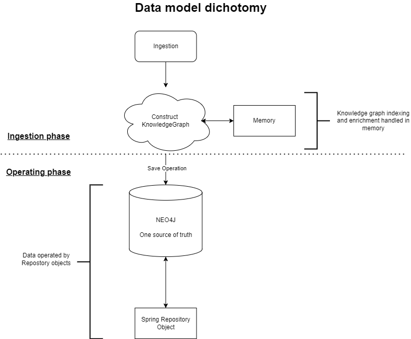

=== Running Neo4j Locally

You can use the Docker Compose file to run the application with Neo4j. Execute the following command to run the Docker Compose file: `docker-compose up`. This command starts Neo4j.

The Docker Compose file also creates a local "Data" folder in the project's root directory. This folder stores the data for Neo4j and is added to the .gitignore file.

=== Neo4j Migrations

The project uses the Neo4j Migrations library to manage database migrations. Migrations are defined in the `src/main/resources/neo4j/migrations` directory.

Migration files follow the naming convention `V<VERSION>__<NAME>.cypher`, where `<VERSION>` represents the migration version and `<NAME>` describes the purpose of the migration.

When the application starts, it automatically executes the migration scripts in version order, ensuring that the database schema is up to date.

To create a new migration script, add a new file with the appropriate naming convention to the `src/main/resources/neo4j/migrations` directory. The migration script should contain Cypher statements to modify the database schema or data.

For more information on writing migration scripts and using the Neo4j Migrations library, refer to the official documentation: https://michael-simons.github.io/neo4j-migrations/2.9.3

==== Handling Mistakes in Migration Scripts

During local development, if you make a mistake in a migration script and need to modify it, you can follow these steps to clean the Neo4j database and re-run the migrations:

1. Stop your Spring Boot application if it's currently running.

2. Open the Neo4j Browser by accessing `http://localhost:7474` in your web browser.

3. In the query editor, execute the following Cypher command to delete all nodes and relationships in the database:
+
[source,cypher]
----
MATCH (n)
DETACH DELETE n;
----
+
This command matches all nodes in the database and deletes them along with any connected relationships.

4. Modify the migration script in the `src/main/resources/neo4j/migrations` directory to fix the mistake.

5. Restart your Spring Boot application.

The application will re-create the Neo4j database and execute all the migration scripts, including the modified one, ensuring that the database schema is up to date.

Note: Be cautious when deleting data from the database, as it permanently removes all nodes and relationships. Make sure you have a backup of your data if needed.

=== Code and text ingestion

* Local endpoint for repository ingestion: `com.telekom.ai4coding.chatbot.controller.RepositoriesController.uploadLocalRepository`
* Gitlab endpoint for repository ingestion: `com.telekom.ai4coding.chatbot.controller.RepositoriesController.uploadGitlabRepository`

Generally Advanced Coding Assistant supports languages like Java, Python, JavaScript, TypeScript, C#, VisualBasic etc.
You can find which languages are supported in `FileType.java`

Also, `.txt`, `.md`, `.adoc` and `.pdf` files are supported.

==== Explicit semantic data enrichment - Knowledge Graphs

Utilizing Abstract Syntax Trees algorithms, Advanced Coding Assistant deconstructs code and creates a knowledge graph
structure. For more detailed information on how a knowledge graph is constructed please study file `KnowledgeGraphBuilder.java`

After knowledge graph creation, generally in th DB there will exist three types of nodes:

* FileNode
* ASTNode
* TextNode

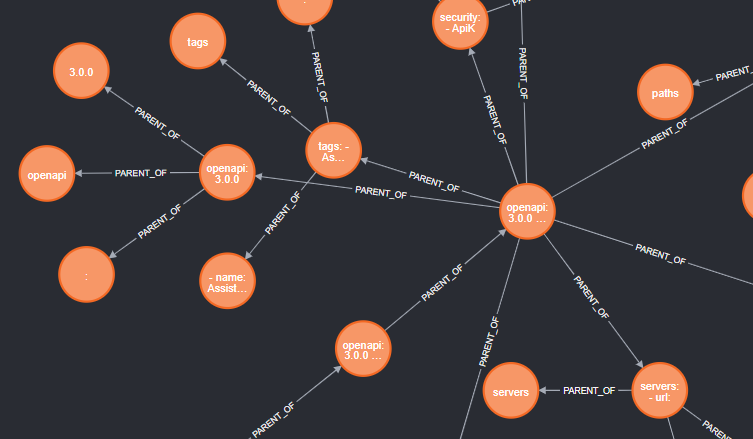

==== Implicit semantic data enrichment - Embeddings

Advanced Coding Assistant also creates embeddings for `ASTNode` and `TextNode` which fit the embedding's model context
window size - 8192 tokens. You can find the embedding model here: `src/main/resources/embedding`

Model page: https://huggingface.co/Alibaba-NLP/gte-base-en-v1.5

The reason we are using a locally deployed embedding model is for speed's sake. `gte-base-en-v1.5` provides enough
resolution while still being usable locally.


== Data Retrieval (RAG)
We support two different RAG approaches:

1. *Agentic RAG*
* Turned on by default
* More intelligent
* Can cost more to run
* Suitable for frontier LLMs like GPT-4

2. **State Machine Data Retrieval**
* Needs to be switched from Agentic RAG if the user wishes to use it
* Simpler and faster
* Doesn't provide "smart" search curated by an LLM
* Suitable for smaller and less capable LLMs (potentially locally run LLMs)
* Cheaper when compared to Agentic RAG

=== Agentic RAG

**Note**: Agentic RAG is available only if the LLM provider supports tools/functions according to OpenAI's specification:
https://platform.openai.com/docs/guides/function-calling ; If you are using a provider which doesn't support OpenAI
function calling (typically a local deployment), use the <<state_machine,State Machine RAG>>

Agentic RAG gives the application the ability to "contemplate" which data may be most useful to answer a User Query. This advanced retrieval-augmented generation process enhances the quality and relevance of responses through a multi-step approach.

Agentic RAG is turned on by default.

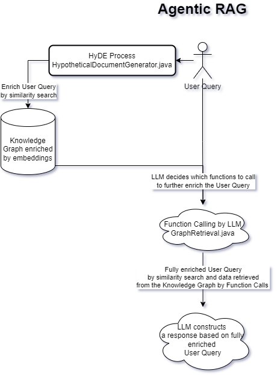

==== How It Works

1. *HyDE (Hypothetical Document Embedding) Process*
* When a user submits a query, the system generates hypothetical content using the `HypotheticalDocumentGenerator`.
* This includes potential code snippets (`getFakeCodeSnippet`) and documentation (`getFakeCodeDocumentation`) relevant to the query.
* Purpose: To create a "bridge" between the user's natural language query and the technical content in the knowledge base.

2. *Embedding-based Search*
* The `EmbeddingSearchService` uses the hypothetical content to search a knowledge graph enriched with embeddings.
* It retrieves relevant ASTNodes (Abstract Syntax Tree nodes) and TextNodes based on similarity to the hypothetical document.
* The retrieved data are inserted in the User Query to provide an entry point which the LLM can utilize for further processing

3. *LLM-driven Function Calling*
* A Language Model (LLM) determines which functions to call based on the User Query which was now contains data from similarity search
to further enrich the User Query. All possible Function Calls are contained in class `GraphRetrieval`
* This step allows for dynamic, context-aware data retrieval from the knowledge graph.

4. *Enriched Response Generation*
* The LLM constructs a final response based on the fully enriched user query.
* This response incorporates relevant information from the knowledge graph and insights from function calls.

==== Key Components

- `GraphRetrieval`: Contains possible Function Calls for an LLM. Responsible for retrieving data from a Neo4j graph database related to a codebase
- `HypotheticalDocumentGenerator`: Generates fake but relevant code snippets and documentation.
- `EmbeddingSearchService`: Performs similarity searches on the knowledge graph using embeddings.
- `CodeContextVerifyAgent`: Filters and verifies the relevance of retrieved code contexts.

==== Benefits

- Improved query understanding through hypothetical content generation.
- More accurate and context-aware information retrieval.
- Dynamic and adaptive response generation tailored to each query.

[[state_machine]]
=== State Machine Data Retrieval
This component provides the ability to use a State Machine Approach for content
retrieval and is suitable for LLMs with lower reasoning capabilities (e.g. local LLMS) and/or
if the user wishes to have more control over the amount of tokens that are spent on
data retrieval (see `CodebaseContentRetriever` the `FillingVesselAlgorithm` file in the repository).

To switch on the State Machine RAG, you have to specify the `state-machine` profile. For example:

[source,poweshell]
----
mvn spring-boot:run -Dspring-boot.run.profiles=azure,state-machine
----

When the `state-machine` profile is turned on, the application will **NOT** use the Agentic RAG.

Default amount of characters retrieved from the Neo4J DB is 30,000 and you can set it via
`aca.filling-vessel-algorithm-max-length`. One token is about 4 characters long.

This is the general flow of State Machine Data Retrieval

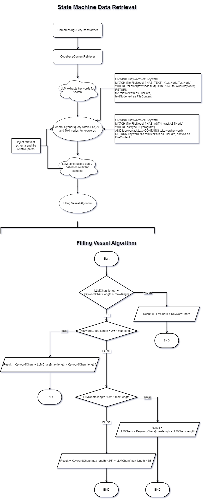

== ELK Logging
=== ELK Setup
Retrieving data from data sources and other LLM communication handled by Langchain4J library may be accompanied by
several back-and-forth calls between the application and the LLM. Therefore we need an easier way how to filter through
logs to be able to quickly spot potential errors in Prompt Engineering logic and to be able to tweak the application.

For this purpose we use ELK stack. Inspired by this article (please read it when setting ELK stack for the first time): https://wirekat.com/how-to-use-the-elk-stack-with-spring-boot/

First, we need the ELK stack running in our Docker:
[source,powershell]
----
# Pull the Elasticsearch image
docker pull docker.elastic.co/elasticsearch/elasticsearch:7.13.4

# Run the Elasticsearch container
docker run -d --name elasticsearch -p 9200:9200 -p 9300:9300 -e "discovery.type=single-node" docker.elastic.co/elasticsearch/elasticsearch:7.13.4

# Pull the Logstash image
docker pull docker.elastic.co/logstash/logstash:7.13.4

# Run the Logstash container
docker run -d --name logstash -p 5001:5001 -p 9600:9600 --link elasticsearch:elasticsearch docker.elastic.co/logstash/logstash:7.13.4

# Pull the Kibana image
docker pull docker.elastic.co/kibana/kibana:7.13.4

# Run the Kibana container
docker run -d --name kibana -p 5601:5601 --link elasticsearch:elasticsearch docker.elastic.co/kibana/kibana:7.13.4
----

Using link:logstash.conf[] add it to the `logstash` image configuration
[source,powershell]
----
# Copy the file to the Logstash container
docker cp logstash.conf logstash:/usr/share/logstash/pipeline/logstash.conf

# Restart the Logstash container
docker restart logstash
----
Add required dependencies into the link:pom.xml[]:
[source,xml]
----
<dependency>
  <groupId>net.logstash.logback</groupId>
  <artifactId>logstash-logback-encoder</artifactId>
  <version>6.6</version>
</dependency>
----
Configure log formatting and loggers in link:chatbot-openai-code-migration-app/src/main/resources/logback-spring.xml[]

=== Kibana filters setup
Using Kibana filters, we can have predefined filters which show only the packages we are interested in link:chatbot-openai-code-migration-app/src/main/resources/application.properties[properties]:
[source,properties]
----
logging.level.org.neo4j.driver.internal.async.outbound=DEBUG
logging.level.dev.langchain4j=DEBUG
logging.level.com.azure.ai.openai=DEBUG
----

Or directly in the link:chatbot-openai-code-migration-app/src/main/resources/logback-spring.xml[]:
[source,xml]
----
    <logger name="dev.langchain4j" level="DEBUG"/>
    <logger name="com.azure.ai.openai" level="DEBUG"/>
    <logger name="org.neo4j.driver.internal.async.outbound" level="DEBUG"/>
----

For Kibana to show only logs from these particular packages, add a filter:

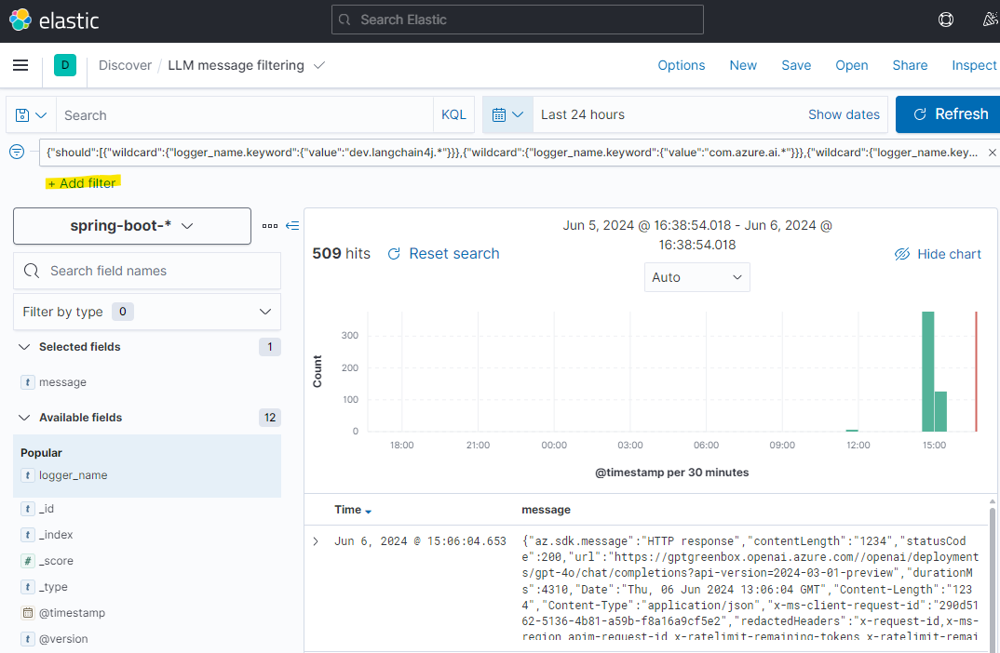

Choose _Edit as Query DSL_

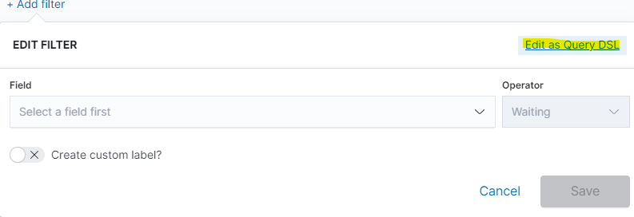

And use and save this JSON:
[source,json]
----
{
  "bool": {
    "should": [
      {
        "wildcard": {
          "logger_name.keyword": {
            "value": "dev.langchain4j.*"
          }
        }
      },
      {
        "wildcard": {
          "logger_name.keyword": {
            "value": "com.azure.ai.*"
          }
        }
      },
      {
        "wildcard": {
          "logger_name.keyword": {
            "value": "org.neo4j.driver.internal.async.outbound.*"
          }
        }
      }
    ],
    "minimum_should_match": 1
  }
}
----

You can also choose from the available fields only the `message` field to be shown in the table. Afterwards save the the whole view:

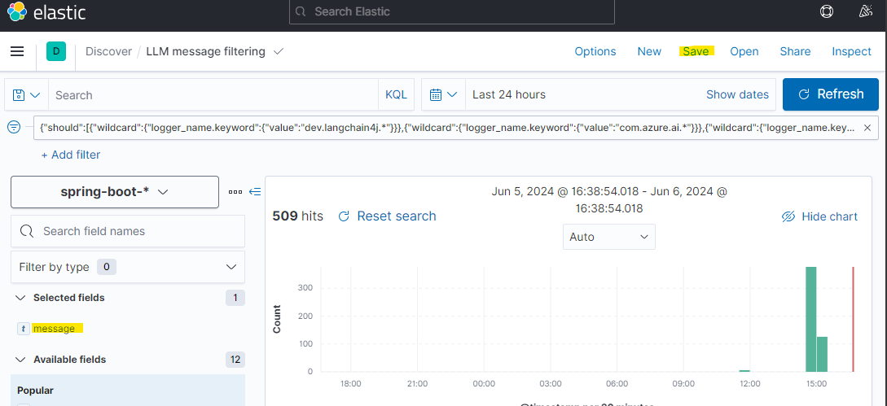

== Project Modules Explanation
This project is structured into several modules to enhance its maintainability, scalability, and clarity.

As we expect several implementations of a chatbot (e.g. code migration, financial helper, G-API definer etc...)
to be developed, we have designed the application to be modular and extensible. Each module is responsible for a specific
aspect of the application, such as the core chatbot functionality,
OpenAI API integration.... This modular design promotes separation of concerns, allowing for independent development,
testing, and deployment of each module.

Below is an overview of each module and its designated purpose within the application.

=== Module: chatbot-openai-code-migration
This module is the core of the code-migration chatbot implementation. It contains the chatbot's business logic,
REST controllers, and service classes that handle the chatbot's interactions with the user and OpenAI's API. The
module is designed to be database-agnostic, allowing for flexible data storage strategies that can be adapted to
the application's requirements over time.

=== Module 'openai-api': OpenAI API Java Client
The openai-api module contains the Java interfaces generated from OpenAI's OpenAPI definition, ensuring our
application adheres to OpenAI's API standards. This module acts as the foundation for our Spring Boot's REST
controllers, facilitating seamless integration with OpenAI's APIs.

Code in module `openai-api` was generated using link:https://github.com/OpenAPITools/openapi-generator[openapi-generator-cli].

The following commands were used to generate the code:

[source]
----
# Download the openapi-generator-cli.jar; version 7.2.0 was used
Invoke-WebRequest -OutFile openapi-generator-cli.jar https://repo1.maven.org/maven2/org/openapitools/openapi-generator-cli/7.2.0/openapi-generator-cli-7.2.0.jar
----

OpenAI's OpenAPI definition was downloaded from the following link: https://github.com/openai/openai-openapi/blob/master/openapi.yaml

[source]
----
# Generate the code using the openapi-generator-cli.jar; Find the openai_openapi.yaml file in the root of the project
java -jar ./openapi-generator-cli.jar generate \
   -i "./openai_openapi.yaml" \
   -g spring \
   --api-package com.telekom.ai4coding.openai.completions \
   --model-package com.telekom.ai4coding.openai.model \
   --additional-properties=artifactId=openai-java,hideGenerationTimestamp=true,interfaceOnly=true \
   -o ./openai-java-client \
   --skip-validate-spec
----

I had to manually fix the generated code to make it compile.

The main problem was that openapi-generator version 7.2.0 still used SpringBoot 2.x, but we are using SpringBoot 3.x.
Mainly, 'javax.validation' package had to be migrated to 'jakarta.validation' package. I assume however, that with
higher versions of openapi-generator, this problem will be solved.

Also, some types had to be changed from Integer to BigDecimal manually. This could be also potentially fixed by using
adding mappings, but I did not test it.

**This is an excerpt from the generated documentation:**

This code was generated by the [OpenAPI Generator](https://openapi-generator.tech) project.
By using the [OpenAPI-Spec](https://openapis.org), you can easily generate an API stub.
This is an example of building API stub interfaces in Java using the Spring framework.

The stubs generated can be used in your existing Spring-MVC or Spring-Boot application to create controller endpoints
by adding ```@Controller``` classes that implement the interface. Eg:

[source,java]
----
@Controller
public class PetController implements PetApi {
// implement all PetApi methods
}
----

You can also use the interface to create [Spring-Cloud Feign clients](http://projects.spring.io/spring-cloud/spring-cloud.html#spring-cloud-feign-inheritance).Eg:

[source,java]
----
@FeignClient(name="pet", url="http://petstore.swagger.io/v2")
public interface PetClient extends PetApi {

}
----

== Build and run as OCI image
**Note**: There is a bug with Liberica's buildpack: https://github.com/paketo-buildpacks/bellsoft-liberica/issues/565
. The workaround was implemented in `chatbot-openai-code-migration-app/pom.xml`

**Note n.2**: As this backend application is mainly focused on ingesting files and directories residing on local filesystem,
we decided that the ** main used artifact is a JAR file, not a Docker image**. When using a Docker image, user would have to
setup volumes, which complicates local installation. However, if for example this backend application is deployed
on a server, it has the option to ingest Gitlab repositories directly. In that case running the application as a Docker
image would suffice.

To build and run the application as OCI image, execute the following commands:
[source]
----
./mvnw clean install -DskipTests
./mvnw -pl chatbot-openai-code-migration-app spring-boot:build-image -DskipTests
----

This will create a Docker image of the application, with name and tag e.g. **chatbot-openai-code-migration-app:0.0.1-SNAPSHOT**

To change image name and/or tag, you can run the following command:

[source]
----
./mvnw -pl chatbot-openai-code-migration-app spring-boot:build-image -DskipTests -DimageName={image name, can include path} -DimageTag={image tag}
----

=== Run the image

Configuration of the application can be found in the _application.properties_ file. Default profile is `azure`.

These are the configuration parameters that can be changed:
|===
|Environment variable |Description
|SPRING_PROFILES_ACTIVE
|Specifies the active Spring Boot profile (e.g., azure, bedrock, local, openai, vertex)
|SPRING_NEO4J_URI
|The connection string for your Neo4j database (e.g. bolt://neo4j:7687)
|SPRING_NEO4J_AUTHENTICATION_USERNAME
|The username for your Neo4j database (e.g. neo4j)
|SPRING_NEO4J_AUTHENTICATION_PASSWORD
|The password for your Neo4j database
|ACA_GITLAB_TOKEN
|Gitlab token with enough permissions to clone the repository
|ACA_FILLINGVESSELALGORITHMMAXLENGTH
|Maximum length for the filling vessel algorithm
|ACA_TOOLRESULTMAXTOKEN
|Maximum token count for tool results
|===

==== Azure Profile Configuration
When using the `azure` profile, the following additional environment variables must be set:
|===
|Environment variable |Description
|AZURE_ENDPOINT
|The Azure OpenAI endpoint URL
|AZURE_MODEL
|The Azure OpenAI deployment name
|AZURE_APIKEY
|The Azure OpenAI API key
|===

==== Bedrock, Vertex, Local, OpenAI Profile Configuration

Using previous sections as an example, all possible configuration properties can be found in these files:

----
chatbot-openai-code-migration-app/src/main/resources/application.properties
chatbot-openai-code-migration-app/src/main/resources/application-azure.example.properties
chatbot-openai-code-migration-app/src/main/resources/application-bedrock.example.properties
chatbot-openai-code-migration-app/src/main/resources/application-local.example.properties
chatbot-openai-code-migration-app/src/main/resources/application-openai.example.properties
chatbot-openai-code-migration-app/src/main/resources/application-vertex.example.properties
----

To run the image locally, execute the following command (don't forget to change the TAG):
[source]
----
docker run -p 8080:8080 chatbot-openai-code-migration-app:0.0.1-SNAPSHOT
----

**Known Bug**: Default profile is the `azure` profile. When building the jar, be sure to have a `chatbot-openai-code-migration-app/src/main/resources/application-azure.properties` in the project, which can be just
a copy of `chatbot-openai-code-migration-app/src/main/resources/application-azure.example.properties`.

The reason is, when the application starts in the default (azure) profile, it expects the `azure.proxy=` property to be present

=== License

Copyright 2024 Deutsche Telekom AG

Licensed under the Apache License, Version 2.0 (the "License"); you may not use this file except in compliance with the License. You may obtain a copy of the License at

----
http://www.apache.org/licenses/LICENSE-2.0
----

Unless required by applicable law or agreed to in writing, software distributed under the License is distributed on an "AS IS" BASIS, WITHOUT WARRANTIES OR CONDITIONS OF ANY KIND, either express or implied. See the License for the specific language governing permissions and limitations under the License.

For third party dual-licenses dependnecies, please look at link:CHOSEN-LICENSES-DEPENDENCIES.md#chosen-licenses-for-dependencies[CHOSEN-LICENSES-DEPENDENCIES.md] where we explicetly choose the licence for dual-licenced dependencies.
